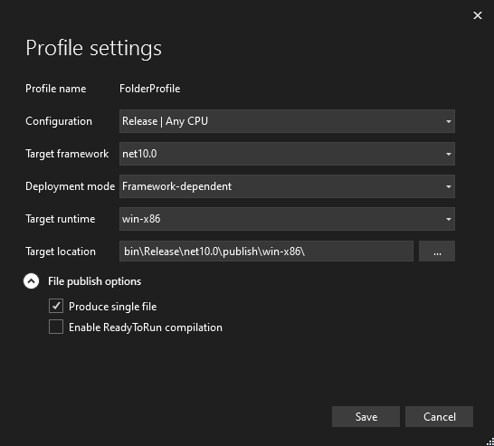

# CLPS2C (Custom Language for PlayStation 2 Cheats) - Compiler
<p align="center">
  
</p>


## Description
CLPS2C is a domain-specific language, built specifically for writing PS2 cheat codes. <br>
Please, refer to the [CLPS2C Documentation](/CLPS2C-Documentation.txt) file for more information. <br>
Please, refer to the [CLPS2C Changelog](/CLPS2C-Changelog.txt) file for information about changes for each version.

## Goal and intention
The main goal of the project is to have better managment and readability when cheats become too big/complex.<br>
The app supports, among other things:
- Write all code types supported by ps2rd and Cheat Device
- Output RAW or pnach-formatted cheat lines
- Write MIPS Assembly (PS2 Emotion Engine R5900)
- Automatic calculation for how many lines to execute in "If" commands
- Support for logical AND in "If" commands
- Set local variables to be referenced by name
- Define functions with arguments and call them
- Include CLPS2C or nocash symbol files in other CLPS2C files

## Example code (CLPS2C)
```
// Variables which will be used later
Set MapID 0x3E1110
Set JobID 0x67381C
Set Player 0x2E1E40
Set CharHP 3D4AB0
Set CharHPMax 40
Set CoinCount 3D4B00
Set MyStr "Parkour_Start\0"

// Function to teleport the player to a location
Function WriteXYZ(base, valueX, valueY, valueZ)
    WritePointerFloat base,58,30 valueX
    WritePointerFloat base,58,34 valueY
    WritePointerFloat base,58,38 valueZ
EndFunction

// Main code
If MapID =: 3 // If in world 3
    Write32 20FB1580 0x123
    If JobID !. 0xFF && CoinCount =: 0 // If not in a job and the player has 0 coins
        Call WriteXYZ(Player, 1500, 2000, 600) // Warp player on top of the house
    EndIf
    Write32 CharHP CharHPMax // Set the player's hp to 40
    WriteString 0x87310 MyStr
EndIf
```
Output:
```
E0110003 003E1110
20FB1580 00000123
E10A00FF 1067381C
E0090000 003D4B00
602E1E40 44BB8000
00020002 00000058
00000030 00000000
602E1E40 44FA0000
00020002 00000058
00000034 00000000
602E1E40 44160000
00020002 00000058
00000038 00000000
203D4AB0 00000028
20087310 6B726150
20087314 5F72756F
20087318 72617453
1008731C 00000074
```

## Example code (CLPS2C - Assembly)
```
// Write the active character's XYZ coordinates (accessed by a pointer)
// to a specific address (003D0E10/4/8)
// If the value at 003D0D00 is 1, then get the values from 003D0E10/4/8
// and write them to the active character's coordinates
// - 002DE2F0,0x58,0x30/4/8 active character's coords 
// - 003D1000 address to store our assembly code (codecave)
// - 003D0E10/4/8 address to store a copy of the coords
// - 003D0D00 custom flag. If it's 1, get the values from 003D0E00/4/8 and write them to the active character's coords
Set Cave 003D1000
ASM_START Cave
    // Go to the active character's transformation component
    lw $t1,0x2DE2F0 // read active character pointer
    addi $t2,$t1,0x58 // add transformation offset
    lw $t2,($t2) // read the transformation pointer
    // Our target address (where we want to store the coords) is at 003D0E10
    lui $at,0x3D // All of our custom addresses are at 003Dnnnn. Load 003D0000
    lw $t3,0x30($t2) // get x coord
    lw $t4,0x34($t2) // get y coord
    lw $t5,0x38($t2) // get z coord
    sw $t3,0xE10($at) // store x coord at custom address
    sw $t4,0xE14($at) // store y coord at custom address
    sw $t5,0xE18($at) // store z coord at custom address
    // Check flag
    lw $t0,0xD00($at)
    li $t1,0x1
    beq $t0,$t1,SetCustomCoords // if the value at 003D0D00 == 1, then branch to SetCustomCoords
    nop // delay slot. Before taking the branch, the cpu will execute this line. Let's place a nop so it doesn't do anything.
    b Exit // else, branch to Exit
    nop // delay slot
    SetCustomCoords: sw $zero,0xD00($at) // set flag to 0
        lw $t3,0xE00($at) // load custom x coord
        lw $t4,0xE04($at) // load custom y coord
        lw $t5,0xE08($at) // load custom z coord
        sw $t3,0x30($t2) // store x coord
        sw $t4,0x34($t2) // store y coord
        sw $t5,0x38($t2) // store z coord
    Exit: jr $ra // return
        nop // delay slot
ASM_END
```
Output:
```
203D1000 3C09002E
203D1004 8D29E2F0
203D1008 212A0058
203D100C 8D4A0000
203D1010 3C01003D
203D1014 8D4B0030
203D1018 8D4C0034
203D101C 8D4D0038
203D1020 AC2B0E10
203D1024 AC2C0E14
203D1028 AC2D0E18
203D102C 8C280D00
203D1030 34090001
203D1034 11090003
203D1038 00000000
203D103C 10000008
203D1040 00000000
203D1044 AC200D00
203D1048 8C2B0E00
203D104C 8C2C0E04
203D1050 8C2D0E08
203D1054 AD4B0030
203D1058 AD4C0034
203D105C AD4D0038
203D1060 03E00008
203D1064 00000000
```

## How to run / Troubleshooting
**IMPORTANT:** .NET Desktop Runtime 10.0 must be installed in order to run this program.<br>
https://dotnet.microsoft.com/en-us/download/dotnet/10.0

Usage:
```
CLPS2C-Compiler.exe
  -i, --input     The file to be parsed. Example: -i "C:\Users\admin\Desktop\CLPS2C\Test1.txt"
  -o, --output    The file in which the output will be written to. Example: -o "C:\Users\admin\Desktop\pcsx2\cheats\SCUS-97316_07652DD9testmod.pnach"
                  If not passed, the output file path will be defaulted to the input's folder, with the same file name as the input file, and appending "-Output" to it.
                  (e.g. "C:\Users\admin\Desktop\CLPS2C\Test1-Output.txt")
  -p, --pnach     The app, by default, produces RAW lines. Enabling this option will convert them to Pnach-formatted lines.
  -d, --dtype     The app, by default, converts "If" commands to E-type codes. Enabling this option will convert them to D-type codes.
  --help          Display an help screen.
  --version       Display version information.
```

It is recommended to use [vscode-clps2c](https://github.com/NiV-L-A/vscode-clps2c), a Visual Studio Code extension for .clps2c files.
<p align="center">
  
</p>
<p align="center">
  
</p>

## TO-DO
- WritePointerString, WritePointerBytes and FillBytes commands.
- If commands with logical OR (||) operator.
- The (VALUE) for the SendRaw and WriteString commands will always be printed as decimal if it's a variable. Add ":X8" or some way to force it hexadecimal.
- Binary representation for values (0b...)

## Build instructions
1. Clone the CLPS2C-Compiler repository by clicking on the "Code" button and selecting "Open with Visual Studio"
2. Run the application by clicking on "Debug" and then "Start Debugging"
  - Do note that debug symbols are not emitted when in "Release" mode. To actually debug the application (e.g. set breakpoints) make sure to be in "Debug" mode

## Release workflow
1. In the Solution Explorer window, right click on the CLPS2C-Compiler project entry, go to "Properties", "Package" and increase the "Package Version"
2. Remove command line arguments
3. Remove unused using directives
4. Change changelog
5. Change version in documentation
6. Update the latest pcsx2 version in `CLPS2C-Documentation.txt` for the Fill8 and Fill16 commands
7. In the Solution Explorer window, right click on the CLPS2C-Compiler project entry and select "Publish". Use the following settings, then click "Publish":
  

## Credits
Author:
- NiV-L-A

Special thanks:
- Sly Cooper Modding Discord Server: https://discord.gg/2GSXcEzPJA
- Luigi Auriemma's QuickBMS: http://aluigi.altervista.org/quickbms.htm
- Icon made by Cooper941: https://www.youtube.com/@Cooper941
- TheOnlyZac for suggesting how to handle certain scenarios: https://github.com/TheOnlyZac
- Testing done by zzamizz: https://github.com/zzamizz
- commandline by commandlineparser: https://github.com/commandlineparser/commandline
- nocash symbol documentation: https://problemkaputt.de/gbatek-symbolic-debug-info.htm